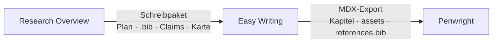
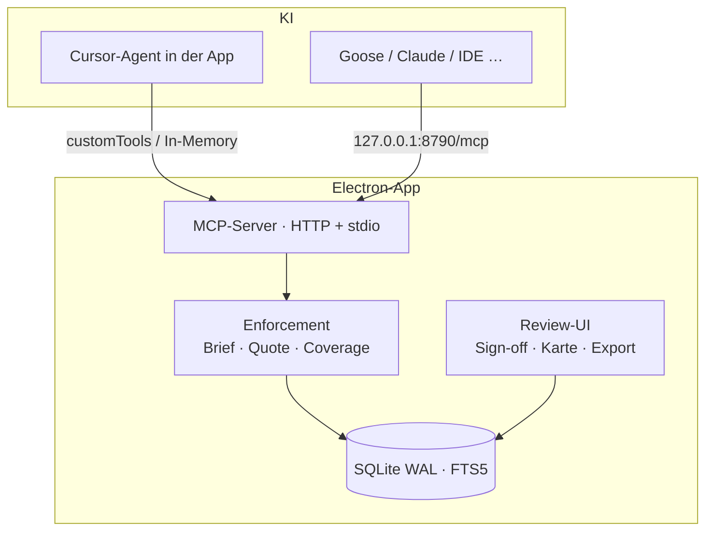

# Research Overview Platform

[](LICENSE)

**Transparente KI-Research — local-first, prüfbar, zitierbar.**

Deep-Research-Werkzeuge liefern Berichte mit Fußnoten. Was fehlt: Nachvollziehbarkeit. Warum wurde diese Quelle genutzt? Was wurde daraus extrahiert? Steht das Zitat wirklich im Original? Bei Deep-Research-Agenten sind Links oft valide, aber die **faktische Deckung liegt nur bei 39–77 %** — und **fällt um ~42 %**, wenn die Tool-Calls von 2 auf 150 steigen ([arXiv 2605.06635](https://arxiv.org/abs/2605.06635)).

Diese App macht daraus ein **prüfbares Artefakt**: die KI recherchiert in der App, der Server erzwingt Provenienz, du signierst — und übergibst ein Schreibpaket an die nächste App, statt einen fertigen Artikel zu erzeugen.

> **Leitprinzip:** KI-Einträge sind nie Wahrheit, sondern *zu verifizierende Behauptungen* mit Status und Konfidenz. Der menschliche Sign-off ist nur in der App möglich — keine KI kann ihn über MCP setzen.

---

## Für wen

Zwei Lieferformen, ein Korpus:

| Du schreibst … | Was hier zählt |
|---|---|
| **Blogs / Kundenstücke** | Blickwinkel und Frame. Der Text selbst ist Commodity — wertvoll ist, *was du behaupten darfst*. |
| **Hausarbeiten, Papers, Abschlussarbeiten** | Zitate mit Seite, empirische Papers, ehrliche Lücken. Nicht „viele Quellen“, sondern passende. |

Die App **schreibt den Artikel nicht**. Nach der Research geht es so weiter:

1. **Recherchieren und prüfen** — diese Plattform
2. **Schreiben** — [Easy Writing](https://github.com/renejes/easy-writing) (Ordnerprojekt, Markdown/MDX, `[@citekey]` / `[@citekey, p. 12]`, Fußnoten)
3. **Setzen und gestalten** — [Penwright](https://github.com/renejes/penwright) (Typst-WYSIWYG: Layout, Preview, Print-PDF)



Easy Writing öffnet den Exportordner und autocompleted dieselben Citekeys. Penwright setzt denselben Ordner — `[@key]` bleibt `[@key]`, die `.bib` bleibt die `.bib`. Wortlaut-Änderungen gehören zurück nach Easy Writing, nicht in den Setzer.

---

## Wie es funktioniert

Alltagsweg: **Cursor-Agent in der App** (dein Cursor-Abo, inkl. WebSearch). Chat links, Beweis rechts. Die IDE ist optional; Goose oder Claude Code können per MCP-HTTP an dieselbe Datenbank andocken.

```
Brief entwerfen → du bestätigst
        │
        ▼
Teilfragen aus dem Brief  (nicht aus der Luft)
        │
        ▼
Gezielte Suche  (Literaturregister + WebSearch)
        │
        ▼
fetch_source → add_source  oder  exclude_source
        │
        ▼
Server misst Lücken und Sättigung  — „ich bin fertig“ zählt nicht
        │
        ▼
Karte, Marks, Sign-off
        │
        ▼
Schreibpaket → Easy Writing → optional Penwright
```

Ohne adoptierten Research-Brief lehnen Suche und Quellenabruf ab. WebSearch **darf entdecken**; was in den Bericht soll, muss als Quelltext in der Datenbank liegen — nicht als Such-Snippet.

| Mechanismus | Was es bedeutet |
|---|---|
| **Unfälschbare Zitate** | `fetch_source` speichert den Text (HTML und PDF). `add_source` bekommt Zeichenpositionen — der Server schneidet das Zitat heraus. Das Modell tippt nichts ab. |
| **Vollständigkeit** | Abgerufene Quellen müssen dokumentiert oder verworfen sein, bevor weitere Abrufe erlaubt sind. |
| **Messbare Tiefe** | Teilfragen, serverseitige Lückenliste, Sättigung pro Runde. |
| **Was darfst du sagen** | Grün = signiert und Quote ok. Gelb = belegt, unsigniert. Rot = Widerspruch, Flag, Lücke, Tabu. |
| **Schreibpaket** | Immer aus einer Kartensicht oder aus Markiertem: Plan, `references.bib`, Claims, Bericht, `do-not-claim.md`, JPEG der Karte. |

Local-first heißt: die **SQLite-Datenbank** bleibt auf deinem Rechner. Die Modelle laufen über Cursor Cloud.

---

## Architektur



**Stack:** Electron · React 18 · Tailwind CSS v4 · better-sqlite3 (WAL, FTS5) · `@cursor/sdk` · `@modelcontextprotocol/sdk` 1.30 · Zod · Vitest

---

## Schnellstart

Voraussetzungen: Node.js 20+, npm, ein [Cursor](https://cursor.com)-Konto (für den Agent-Chat).

```bash
git clone https://github.com/renejes/research-overview-platform.git
cd research-overview-platform
npm install

npm test          # Unit-Tests (Node-ABI)
npm run smoke     # E2E gegen den MCP-HTTP-Server
npm start         # App (Electron-ABI + Dev-Server)
```

`better-sqlite3` ist ein natives Addon. `npm run abi:node` / `npm run abi:electron` schalten zwischen Tests und App um. `npm start` macht den Electron-Rebuild selbst.

In der App: Einstellungen → bei Cursor anmelden → benanntes Modell wählen (nicht Auto) → Projekt anlegen → im Chat den Brief erarbeiten, dann erst suchen.

### MCP für die IDE (optional)

Dieselbe App muss laufen, sonst ist Port 8790 tot. Config liegt im Repo (`.cursor/mcp.json`) und in den Einstellungen:

```json
{
  "mcpServers": {
    "research-overview": {
      "url": "http://127.0.0.1:8790/mcp"
    }
  }
}
```

Kein `"type"`-Feld — Cursor erkennt Streamable HTTP am `url`-Feld. **Agent-Modus**, nicht Chat. Allowlist: `.cursor/permissions.json`. Arbeitsvertrag: [`.cursor/rules/transparent-research.mdc`](.cursor/rules/transparent-research.mdc).

stdio (Claude Desktop) als Fallback in den Einstellungen. Alle Clients teilen dieselbe SQLite (WAL).

---

## MCP-Tools (Auszug)

| Tool | Zweck |
|---|---|
| `draft_research_brief` / `adopt_research_brief` | Blickwinkel und Plan, bevor gesucht wird |
| `fetch_source` / `add_source` / `exclude_source` | Quellen mit erzwungener Provenienz |
| `plan_research` / `get_coverage_gaps` / `next_round` | Teilfragen, Lücken, Sättigung |
| `search_literature` | OpenAlex, Crossref, Europe PMC |
| `reflect_search` | Lage nach einer Suchwelle, bevor erneut gesucht wird |
| `ingest_local_file` / `list_inbox` | PDFs und Text aus der Projekt-Inbox |
| `describe_evidence_map` / `prepare_view` / `toggle_mark` | Karte und Arbeitsset |
| `export_bibliography` / `export_writing_pack` | `.bib` und Schreibpaket für Easy Writing |
| `re_verify` / `get_next_unverified_claim` / `submit_verdict` | Verifikations-Leiter |

Prompts sind zusätzlich als Werkzeuge gespiegelt (`start_transparent_research` …), weil die meisten Clients Prompts nicht ausführen.

---

## Verifikations-Leiter

1. **Deterministisch** — Quote-in-Source am gespeicherten Text. Kein Modell nötig.
2. **Geblindete KI-Prüfung** — neue Session sieht nur Aussage + Quelltext, nie die Original-Begründung.
3. **Cross-Client** (optional) — dieselbe Prüfung in einem anderen Anbieter.
4. **Mensch-Sign-off** — nur in der App, append-only `event_log`.

---

## Projektstruktur

```
src/main/core/        DB, Repo, Enforcement, Cursor-Agent, Testharness
src/main/mcp/         MCP-Server, HTTP, stdio
src/preload/          Typisierte IPC-Brücke
src/renderer/         React-UI: Chat, Übersicht, Quellen, Karte, Export
.cursor/              mcp.json, permissions.json, hooks.json, Rule
skills/               Claude-Code-Skill + Such-Ingest-Hook
documentation/        Plan, Status, Next Steps · Archiv in documentation/done/
```

---

## Dokumentation

| Dokument | Inhalt |
|---|---|
| [01 Implementation-Plan](documentation/01-implementationplan.md) | Architektur und Phasen (A/B/E–H gebaut) |
| [02 Projekt-Status](documentation/02-project-status.md) | Aktueller Stand und Funktionsweise (2026-08-24) |
| [03 Next Steps](documentation/03-next-steps.md) | Empirische Tests (echter Modell-Lauf) |
| [HANDOVER.md](HANDOVER.md) | Kontext für Contributors |
| Archiv | [04](documentation/done/04-feasability.md) · [05](documentation/done/05-market-research.md) · [06](documentation/done/06-eigene-research-engine.md) · [07](documentation/done/07-clients.md) |

```bash
npm run typecheck
npm run abi:node && npm test
npm run smoke
```

---

## Im selben Schreibtisch

| App | Rolle | Lizenz |
|---|---|---|
| **Research Overview** (diese) | Research, Provenienz, Sign-off, Schreibpaket | MIT |
| **[Easy Writing](https://github.com/renejes/easy-writing)** | Schreiben in Markdown/MDX, Zitate, Fußnoten, Export | MIT |
| **[Penwright](https://github.com/renejes/penwright)** | Setzen und Design in Typst, Live-Preview, Print-PDF | [PolyForm Strict](https://github.com/renejes/penwright#license) — App frei nutzen, Source nicht wiederverwenden |

---

## Lizenz

[MIT](LICENSE) — Copyright (c) 2026 René Jesser

Open Source, weil ein Provenienz-Werkzeug, dessen Prüflogik nicht nachlesbar ist, ein Widerspruch in sich wäre. Kein Geschäftsmodell.

Fragen, Issues und Pull Requests willkommen.
