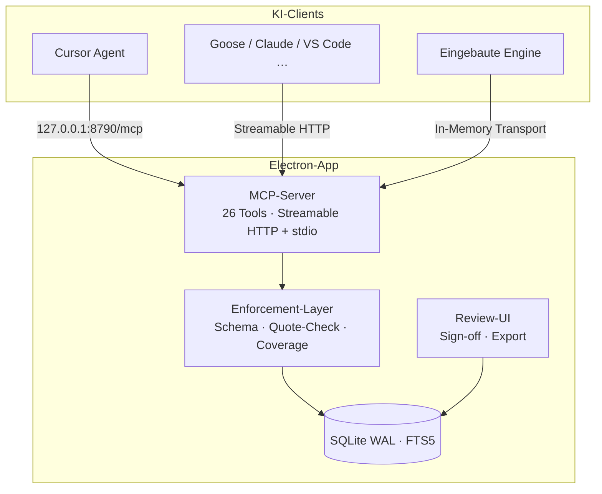

# Research Overview Platform

[](LICENSE)

**Transparente KI-Research — local-first, prüfbar, zitierbar.**

Deep-Research-Werkzeuge liefern Berichte mit Fußnoten. Was fehlt: Nachvollziehbarkeit. Warum wurde diese Quelle genutzt? Was wurde daraus extrahiert? Steht das Zitat wirklich im Original? Die Forschungslage ist ernüchternd: Bei Deep-Research-Agenten sind Links oft valide, aber die **faktische Deckung liegt nur bei 39–77 %** — und **fällt um ~42 %**, wenn die Tool-Calls von 2 auf 150 steigen ([arXiv 2605.06635](https://arxiv.org/abs/2605.06635)).

Die Research Overview Platform verwandelt KI-Deep-Research von einer Blackbox in ein **prüfbares Audit-Artefakt**. Jede angedockte KI trägt Quellen strukturiert ein; der Server erzwingt Provenienz, verifiziert Belege deterministisch und liefert am Ende ein **zitierbares Export-Paket**.

> **Leitprinzip:** KI-Einträge sind nie Wahrheit, sondern *zu verifizierende Behauptungen* mit Status und Konfidenz. Der menschliche Sign-off ist nur in der App möglich — keine KI kann ihn über MCP setzen.

---

## Was die Plattform leistet

| Mechanismus | Was es bedeutet |
|---|---|
| **Unfälschbare Zitate** | `fetch_source` speichert den Quelltext; `add_source` nimmt Zeichenpositionen — der Server schneidet das Zitat heraus. Das Modell kann kein Zitat erfinden, nur auf vorhandenen Text zeigen. |
| **Vollständigkeit** | Abgerufene Quellen müssen per `add_source` oder `exclude_source` dokumentiert werden, bevor weitere Abrufe erlaubt sind. |
| **Messbare Tiefe** | Teilfragen, serverseitige Lückenliste (`get_coverage_gaps`), Sättigung pro Runde (`next_round`). „Ich bin fertig“ schließt keine Lücke — nur Belege. |
| **Verifikations-Leiter** | Deterministisch → geblindete KI-Prüfung → optional Cross-Client → menschlicher Sign-off. |
| **Zwei Betriebsmodi** | Fremdclient (**Cursor**, Goose, Claude Code, …) **oder** eingebaute Engine mit Ollama — dieselbe DB, dasselbe Enforcement. |

---

## Architektur



**Stack:** Electron · React 18 · Tailwind CSS v4 · better-sqlite3 (WAL, FTS5) · `@modelcontextprotocol/sdk` 1.30 · Zod · Vitest

---

## Schnellstart

### Voraussetzungen

- Node.js 20+
- npm

### Installation & Entwicklung

```bash
git clone https://github.com/renejes/research-overview-platform.git
cd research-overview-platform
npm install

# Tests (Node-ABI)
npm test          # Unit-Tests
npm run smoke     # E2E: MCP-Client, Fabrikations-Erkennung, Concurrency

# App starten (Electron-ABI für better-sqlite3, dann Dev-Server)
npm start
```

`better-sqlite3` ist ein natives Addon — Node- und Electron-ABI unterscheiden sich. `npm run abi:node` / `npm run abi:electron` schalten um.

### KI-Client verbinden

**Cursor (empfohlen):** App starten (`npm start`), dann `.cursor/mcp.json` (liegt im Repo) oder das Snippet aus den App-Einstellungen. In Multi-Root-Workspaces ggf. `~/.cursor/mcp.json`. **Agent-Modus** öffnen — im Chat sind MCP-Werkzeuge unsichtbar. Allowlist: `.cursor/permissions.json` (`research-overview:*`). Einstieg: `start_transparent_research`. Die Rule [`.cursor/rules/transparent-research.mdc`](.cursor/rules/transparent-research.mdc) trägt den Arbeitsvertrag; der Hook [`.cursor/hooks.json`](.cursor/hooks.json) protokolliert WebSearch und weist WebFetch ab.

```json
{
  "mcpServers": {
    "research-overview": {
      "url": "http://127.0.0.1:8790/mcp"
    }
  }
}
```

Kein `"type"`-Feld — Cursor erkennt Streamable HTTP am `url`-Feld; ein explizites `streamable-http` kann die CLI-Config stillschweigend verwerfen.

**Andere Clients:** derselbe Endpoint. stdio (Claude Desktop) als Fallback in den App-Einstellungen. Beide Wege teilen dieselbe SQLite-DB (WAL) — Einträge erscheinen live in der App.

---

## Empfohlene Nutzung mit Cursor

Die Plattform nutzt das Research-Verhalten von Frontier-Modellen und erzwingt Transparenz serverseitig — unabhängig vom Client:

1. **App starten** (`npm start`), MCP in Cursor eintragen, Agent-Modus mit **benanntem Modell** (nicht Auto).
2. **Research:** Werkzeug `start_transparent_research`. WebSearch darf entdecken; Berichtsquellen nur per `fetch_source` (auch PDF). WebFetch wird vom Projekt-Hook abgewiesen.
3. **Verifikation:** Neue Agent-Session, `start_verify_session`; menschlicher Sign-off in der App.
4. **Diskussion:** `start_discuss_research` — Fragen strikt aus erfassten Quellen, keine neue Recherche.

Claude Code bleibt optional (Skill + Hooks). Details: [documentation/07-clients.md](documentation/07-clients.md).

---

## MCP-Tools (Auszug)

| Tool | Zweck |
|---|---|
| `create_project` / `list_projects` / `get_project_state` | Projekt-Lebenszyklus |
| `fetch_source` / `add_source` / `exclude_source` | Quellen mit erzwungener Provenienz |
| `plan_research` / `get_coverage_gaps` / `next_round` | Teilfragen, Lücken, Sättigung |
| `search_literature` | OpenAlex, Crossref, Europe PMC, arXiv parallel |
| `log_extraction` / `link_claim_to_source` | Extraktionen; Aussagen↔Quellen (many-to-many) |
| `add_report_version` / `add_chat_log` | Berichts-Snapshots; Chat-Protokoll |
| `re_verify` / `get_next_unverified_claim` / `submit_verdict` | Verifikations-Leiter |

Jeder MCP-Prompt ist zusätzlich als Werkzeug gespiegelt (`start_transparent_research` …) für Clients ohne Prompt-Ausführung.

---

## Verifikations-Leiter

1. **Deterministisch** — URL/DOI-Auflösung + Quote-in-Source (exakt/normalisiert/fuzzy). Kein Modell nötig.
2. **Geblindete KI-Verifikation** — neue Chat-Session sieht nur Aussage + frisch gefetchten Quelltext, nie die Original-Begründung.
3. **Cross-Client** (optional) — Verifikation in einem anderen KI-Anbieter.
4. **Mensch-Sign-off** — pro Quelle in der App; protokolliert im append-only `event_log`.

---

## Projektstruktur

```
src/main/core/        DB, Repo, Services (Enforcement), Engine, Provider
src/main/mcp/         MCP-Server, HTTP-Transport, stdio-Entry
src/main/index.ts     Electron Main + eingebauter MCP-HTTP-Server
src/preload/          Typisierte IPC-Brücke
src/renderer/         React-UI: Übersicht, Quellen-Review, Berichte, Audit
.cursor/              mcp.json, permissions.json, hooks.json, Rule
skills/               Claude-Code-Skill + Cursor-Such-Ingest-Hook + optionale Provenienz-Gate-Hooks
documentation/        Konzept & Research (01–07)
scripts/              Smoke-Tests, Ollama-/Literatur-Checks
```

---

## Dokumentation

| Dokument | Inhalt |
|---|---|
| [HANDOVER.md](HANDOVER.md) | Vollständiger Kontext für neue Contributors |
| [01 Implementation-Plan](documentation/01-implementationplan.md) | Architektur, Datenmodell, Phasenplan |
| [02 Projekt-Status](documentation/02-project-status.md) | Stand, Entscheidungen, Risiko-Register |
| [03 Next Steps](documentation/03-next-steps.md) | Offene Schritte und Spike-Plan |
| [04 Feasibility](documentation/04-feasability.md) | Machbarkeits-Analyse |
| [05 Markt-Research](documentation/05-market-research.md) | Wettbewerbsanalyse |
| [06 Eigene Research-Engine](documentation/06-eigene-research-engine.md) | Engine-Modus, Ollama |
| [07 KI-Clients](documentation/07-clients.md) | Client-Kompatibilität |

---

## Entwicklung & Qualität

```bash
npm run typecheck   # TypeScript strict (beide Configs)
npm run abi:node && npm test
npm run smoke       # E2E gegen echten MCP-Client
npm run build       # Production-Build
```

Zusätzlich: `npm run ollama:check <modell>` (Live-Test mit Tool-Call), `npm run lit:check "frage"` (Literatur-APIs).

---

## Lizenz

[MIT](LICENSE) — Copyright (c) 2026 René Jesser

---

## Hintergrund

Open Source, weil ein Provenienz-Werkzeug, dessen Prüflogik nicht nachlesbar ist, ein Widerspruch in sich wäre. Kein Geschäftsmodell — ein Werkzeug für akademische Recherche und Business-Research gleichermaßen.

Fragen, Issues und Pull Requests willkommen.
