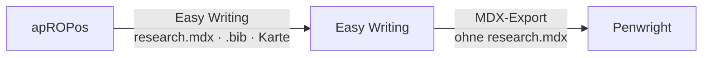
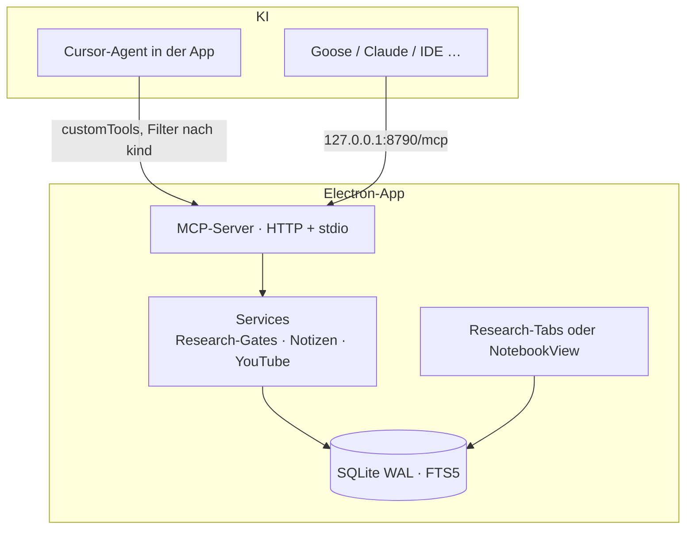

# apROPos

[](LICENSE)

**apROPos** — apropos Quellen. Research und Notebook, **ROP** in der Mitte.

**Local-first Desktop-App: KI-Research, die du prüfen kannst — und ein Notebook über deine Quellen, dessen Notizen du selbst editierst.**

Zwei Arbeitsweisen, ein Cursor-Abo, eine SQLite-Datei auf deinem Rechner. Die Modelle laufen über Cursor Cloud. Kein zweites Konto, keine zweite IDE.

| Du öffnest ein … | Dann |
|---|---|
| **Research-Projekt** | Brief und Blickwinkel klären, gezielt suchen, Offset-Zitate, Karte, Sign-off, Dossier nach Easy Writing. Die App **schreibt den Artikel nicht**. |
| **Notebook-Projekt** | PDFs und YouTube-Links ablegen, im Chat fragen, Antworten als **bearbeitbare Markdown-Notizen** speichern, optional HTML-Folien/Tabellen unter `artifacts/`. |

Deep-Research-Werkzeuge liefern Berichte mit Fußnoten. Was oft fehlt: Nachvollziehbarkeit. Links können stimmen, die **faktische Deckung liegt trotzdem nur bei 39–77 %** — und **fällt um ~42 %**, wenn die Tool-Calls von 2 auf 150 steigen ([arXiv 2605.06635](https://arxiv.org/abs/2605.06635)).

Im Research-Modus macht die App daraus ein **prüfbares Artefakt**: die KI recherchiert hier, der Server erzwingt Provenienz, du signierst.

> **Leitprinzip:** KI-Einträge sind nie Wahrheit, sondern *zu verifizierende Behauptungen* mit Status. Der menschliche Sign-off ist nur in der App möglich — keine KI setzt ihn über MCP.

---

## Für wen

**Research** — zwei Lieferformen, ein Korpus:

| Du schreibst … | Was hier zählt |
|---|---|
| **Blogs / Kundenstücke** | Blickwinkel und Frame. Der Text selbst ist Commodity — wertvoll ist, *was du behaupten darfst*. |
| **Hausarbeiten, Papers, Abschlussarbeiten** | Zitate mit Seite, empirische Papers, ehrliche Lücken. Nicht „viele Quellen“, sondern passende. |

**Notebook** — wenn du Quellen *hast* (Paper-PDFs, Vorträge auf YouTube) und sie befragen willst, ohne Forschungsbrief und Evidenzkarte. Anders als NotebookLM: Notizen sind Markdown und **von dir editierbar**. Wörtliche Stellen, die später als Zitat gelten sollen, bleiben gegroundet (Offsets, der Server schneidet den Text).

Hochgeladene PDFs sind **Seed-Quellen** im selben Korpus — sie bleiben im Projekt, unabhängig vom Chat.

Nach der Research geht es so weiter:

1. **Recherchieren und prüfen** — diese Plattform
2. **Schreiben** — [Easy Writing](https://github.com/renejes/easy-writing) (Ordnerprojekt, Markdown/MDX, `[@citekey]` / `[@citekey, p. 12]`, Fußnoten)
3. **Setzen und gestalten** — [Penwright](https://github.com/renejes/penwright) (Typst-WYSIWYG: Layout, Preview, Print-PDF)



Easy Writing öffnet denselben Ordner: `research.mdx` ist das Dossier, `index.mdx` bzw. die Paper-Kapitel bleiben zum Schreiben. Citekeys in der `.bib` stimmen. Beim Export dort `research.mdx` abwählen.

---

## Wie Research funktioniert

Alltagsweg: **Cursor-Agent in der App**. Chat links, Beweis rechts. Goose oder Claude Code können per MCP-HTTP an dieselbe Datenbank andocken.

```
PDFs in den Korpus  (optional, ohne Brief)
        │
        ▼
Brief entwerfen → du bestätigst
        │
        ▼
Teilfragen aus dem Brief
        │
        ▼
Suche  (Korpus, dann Literaturregister + WebSearch)
        │
        ▼
Lage nach jeder Welle  (reflect_search)
        │
        ▼
fetch_source / read_document → add_source  oder  exclude_source
        │
        ▼
Server misst Lücken  — „ich bin fertig“ zählt nicht
        │
        ▼
Karte, Marks, Sign-off → Easy Writing
```

Ohne adoptierten Brief lehnen Suche und Quellenabruf ab. Uploads brauchen keinen Brief. WebSearch **darf entdecken**; was in den Bericht soll, muss als Quelltext in der Datenbank liegen.

| Mechanismus | Was es bedeutet |
|---|---|
| **Unfälschbare Zitate** | Der Server speichert den Text und schneidet das Zitat an Zeichenpositionen. Das Modell tippt nichts ab. |
| **Seed-Korpus** | Hochgeladene PDFs zuerst durchsuchen, dann belegen. |
| **Such-Lage** | Nach jeder Welle: was getroffen ist, was fehlt, was als Nächstes passiert. |
| **Messbare Tiefe** | Teilfragen, Lückenliste, Sättigung pro Runde. |
| **Was darfst du sagen** | Grün = signiert und Quote ok. Gelb = belegt, unsigniert. Rot = Widerspruch, Flag, Lücke, Tabu. |

## Wie Notebook funktioniert

```
PDF / YouTube (Untertitel) in den Korpus
        │
        ▼
Chat: Frage an den Cursor-Agenten (nur Korpus-Werkzeuge)
        │
        ▼
Antwort → Notiz (Markdown, editierbar)  oder  artifacts/*.html
```

Ohne Untertitel legt die App kein leeres YouTube-Dokument an. HTML-Vorschau läuft in einem iframe ohne `allow-same-origin`. Verdrahtung: [documentation/08-notebook.md](documentation/08-notebook.md).

Local-first heißt: die **SQLite-Datenbank** bleibt auf deinem Rechner.

---

## Architektur



**Stack:** Electron · React 18 · Tailwind CSS v4 · better-sqlite3 (WAL, FTS5) · `@cursor/sdk` · `@modelcontextprotocol/sdk` 1.30 · Zod · Vitest

Die Oberfläche ist Familie zu Easy Writing: weiße Fläche, schwarze Linie, Invert für Auswahl. Farbe nur, wo sie Bedeutung trägt.

---

## Schnellstart

Voraussetzungen: Node.js 20+, npm, ein [Cursor](https://cursor.com)-Konto (für den Agent-Chat).

```bash
git clone https://github.com/renejes/apropos.git
cd apropos
npm install

npm test          # Unit-Tests (Node-ABI)
npm run smoke     # E2E gegen den MCP-HTTP-Server
npm start         # App (Electron-ABI + Dev-Server)
```

`better-sqlite3` ist ein natives Addon. `npm run abi:node` / `npm run abi:electron` schalten zwischen Tests und App um. `npm start` macht den Electron-Rebuild selbst.

In der App: Einstellungen → bei Cursor anmelden → benanntes Modell (nicht Auto) → **Neues Projekt** → Research oder Notebook.

### MCP für die IDE (optional)

Dieselbe App muss laufen, sonst ist Port 8790 tot. Config: `.cursor/mcp.json`.

```json
{
  "mcpServers": {
    "research-overview": {
      "url": "http://127.0.0.1:8790/mcp"
    }
  }
}
```

Kein `"type"`-Feld. **Agent-Modus**, nicht Chat. Allowlist: `.cursor/permissions.json`. Arbeitsvertrag Research: [`.cursor/rules/transparent-research.mdc`](.cursor/rules/transparent-research.mdc). Der WebSearch-Hook fragt `GET /ingest/search-gate`; ist die App tot, darf die Suche durch (Fail-open).

Die MCP-Server-ID bleibt `research-overview`, damit bestehende Cursor-Configs weiterlaufen. Datenbank und Agent-Workspaces liegen unter Application Support / APPDATA `apropos`.

stdio (Claude Desktop) als Fallback in den Einstellungen. Alle Clients teilen dieselbe SQLite (WAL).

---

## MCP-Tools (Auszug)

| Tool | Zweck |
|---|---|
| `draft_research_brief` / `adopt_research_brief` | Blickwinkel, bevor gesucht wird (Research) |
| `list_corpus` / `search_documents` / `read_document` | Seed-PDFs, YouTube-Transkripte, abgerufene Texte |
| `fetch_source` / `add_source` / `exclude_source` | Quellen mit erzwungener Provenienz |
| `save_note` / `list_notes` / `update_note` | Notebook-Notizen (Offsets schneidet der Server) |
| `list_artifacts` | Dateien unter `artifacts/` |
| `plan_research` / `get_coverage_gaps` / `next_round` | Teilfragen, Lücken, Sättigung |
| `search_literature` | OpenAlex, Crossref, Europe PMC |
| `reflect_search` | Lage nach einer Suchwelle |
| `export_easy_writing` / `export_writing_pack` | Easy-Writing-Ordner bzw. Markdown-Schreibpaket |

Prompts sind zusätzlich als Werkzeuge gespiegelt (`start_transparent_research` …), weil die meisten Clients Prompts nicht ausführen.

---

## Verifikations-Leiter (Research)

1. **Deterministisch** — Quote-in-Source am gespeicherten Text.
2. **Geblindete KI-Prüfung** — neue Session sieht nur Aussage + Quelltext.
3. **Cross-Client** (optional).
4. **Mensch-Sign-off** — nur in der App, append-only `event_log`.

---

## Projektstruktur

```
src/main/core/        DB, Repo, Enforcement, Cursor-Agent, Notizen, YouTube
src/main/mcp/         MCP-Server, HTTP, stdio, Such-Gate
src/preload/          Typisierte IPC-Brücke
src/renderer/         React-UI: Chat, Research-Tabs, NotebookView
.cursor/              mcp.json, permissions.json, hooks.json, Rule
skills/               Claude-Code-Skill + Such-Ingest-Hook
documentation/        Plan, Status, Next Steps, Notebook-Verdrahtung · Archiv in done/
HANDOVER.md           Einstieg für einen neuen Chat / Contributor
```

---

## Dokumentation

| Dokument | Inhalt |
|---|---|
| [HANDOVER.md](HANDOVER.md) | Kurz: Produkt, Regeln, Fallstricke — für den nächsten Chat |
| [01 Implementation-Plan](documentation/01-implementationplan.md) | Architektur und Phasen (A/B/E–I gebaut) |
| [02 Projekt-Status](documentation/02-project-status.md) | Aktueller Stand (2026-08-30) |
| [03 Next Steps](documentation/03-next-steps.md) | Echter Modell-Lauf (Research) |
| [08 Notebook](documentation/08-notebook.md) | Unterschiede Research/Notebook, Dateien, Gates |
| Archiv | [04](documentation/done/04-feasability.md) · [05](documentation/done/05-market-research.md) · [06](documentation/done/06-eigene-research-engine.md) · [07](documentation/done/07-clients.md) |

```bash
npm run typecheck
npm run abi:node && npm test
npm run smoke
```

---

## Im selben Schreibtisch

| App | Rolle | Lizenz |
|---|---|---|
| **[apROPos](https://github.com/renejes/apropos)** (diese) | Research + Notebook, Provenienz, Sign-off, Schreibpaket | GPL-3.0-or-later |
| **[Easy Writing](https://github.com/renejes/easy-writing)** | Schreiben in Markdown/MDX, Zitate, Fußnoten, Export | MIT |
| **[Penwright](https://github.com/renejes/penwright)** | Setzen und Design in Typst, Live-Preview, Print-PDF | [PolyForm Strict](https://github.com/renejes/penwright#license) |

---

## Lizenz

[GNU GPL v3 oder später](LICENSE) — Copyright (c) 2026 René Jesser.

Die Prüflogik bleibt nachlesbar. GPL verhindert, dass jemand den Code nimmt, die App schließt und als proprietäres Produkt weiterverkauft, ohne den Quelltext offenzulegen.

**Verkaufen:** GPL verbietet Verkauf nicht. Wer die App unter GPL bekommt, darf sie weitergeben — inklusive Quelltext. Ein klassisches Produktgeschäft (Lizenz kaufen, Binary behalten, niemandem den Code geben) ist GPL allein **nicht**. Der übliche Weg als alleiniger Copyright-Inhaber: **Dual-Lizenz** — diese GPL-Fassung bleibt öffentlich; eine kommerzielle Lizenz für Kunden, die kein Copyleft wollen. Dafür keine fremden Beiträge ohne Contributor License Agreement annehmen.

`@cursor/sdk` unterliegt den [Cursor-Nutzungsbedingungen](https://cursor.com/terms-of-service) (proprietär). Dafür gibt es in der LICENSE eine zusätzliche Erlaubnis nach GPL §7, damit das Linken mit dem SDK die GPL-Fassung dieses Repos nicht bricht.

Fragen, Issues und Pull Requests willkommen. PRs ohne CLA können die Dual-Lizenz später erschweren.
